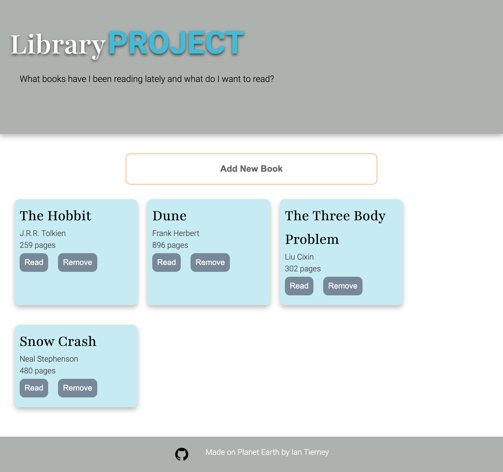
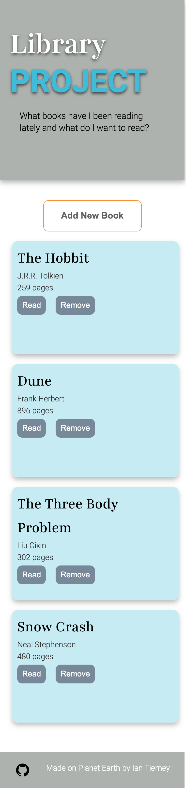

## A Library of Books

This project goal was to create a library of books that could be dynamicly sized for different screens. This is built using Object Oriented Programming so the use of constructors and classes was new. I also learned about the value of OOP 'componitizing' to break logic up and decouple it from each other. I could create multiple libraries for different users and call book class to have common objects throughout the libraries. 

The user can add new books, change the read status and remove the book. 

This project was built with HTML, CSS and Javascript.

### Desktop view

### Mobile view

